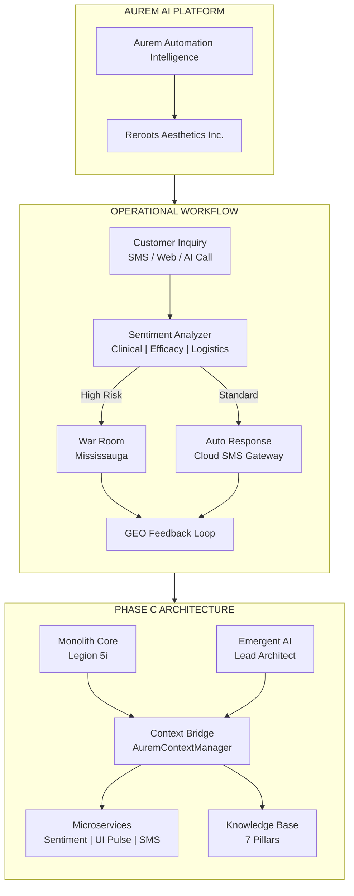

# AUREM Full Business Structure Diagram

> Source: User-provided business architecture (Lyra)
> Purpose: Complete 3-layer business structure — Corporate, Operational, Technical
> Saved: February 2026

---

## Layer 1: Corporate & Brand (The "Head")

- **Parent Entity**: Aurem AI Platform (overarching intelligence engine)
- **Subsidiary/Brand**: Reroots Aesthetics Inc. (consumer-facing biotech skincare)
  - Function: Primary data lab and implementation case for Aurem AI

## Layer 2: Operational Workflow (The "Body")

1. **Ingress**: Customer inquiry (SMS, Web, AI Call)
2. **Processing**: Aurem Sentiment Analyzer (Clinical_Inquiry vs Efficacy_Concern)
3. **Action**:
   - High Risk → Panic Hook in War Room (Mississauga)
   - Standard → Automated response via Cloud SMS Gateway
4. **Feedback Loop**: Data indexed for GEO (Generative Engine Optimization)

## Layer 3: Technical Architecture (The "Nervous System")

| Component | Role | Location |
|-----------|------|----------|
| Monolith Core | Legacy server (being modularized) | Local (Legion) |
| Emergent AI | Developer agent managing 40k lines | Local (Legion) |
| Context Bridge | AuremContextManager gatekeeper | Local (Legion) |
| Microservices | Sentiment, UI Pulse, Cloud SMS | Cloud/Hybrid |
| Knowledge Base | 7 Pillars (Directives, Schemas, Auth) | Memory/Vector DB |

---

## Mermaid.js Diagram Code

---

## Generating the Visual

Paste the Mermaid code above into:
- https://mermaid.live
- Or use the ChatGPT prompt: "Create a Mermaid.js diagram for a Scientific-Luxe business structure showing Python Monolith, Cloud SMS Gateway, and Biotech Skincare brand (Reroots). Use copper-themed labels."
