# AUREM ORA — System Architecture

> ⚠️ **REFERENCE / HISTORICAL DOC** — last refreshed iter 287.7 (Apr 2026).
> The mermaid diagram + 26-service integration table below remain
> topologically accurate, but for the CURRENT, AUTHORITATIVE source on
> tech stack + integrations + env vars, read **`SPEC_02_TRD.md`** first.
>
> Diagram is from 2026-04-05 iter baseline.
> Recent additions since baseline (2026-04 iters 285-287) documented in **`CHANGELOG.md`**:
> ORA Command Center (any-language + founder-gated), Master Autopilot (daily Scout→Hunt→Blast→Report),
> Apollo DIY Proxy (website scraper + email guesser), Twilio WABA migration (WHAPI banned),
> Deploy Webhook fallback, Morning Brief / Evening Wrap notifiers, Alert Digest mode,
> 7-day Free Trial promo + Animated Mascot.

## Mermaid.js Diagram

```mermaid
graph TB
    subgraph CLIENT["CLIENT LAYER"]
        direction TB
        Browser["Browser (React SPA)"]
        EmbedScript["Embed Script<br/>&lt;script&gt; tag on customer sites"]
    end

    subgraph FRONTEND["FRONTEND — React :3000"]
        direction TB

        subgraph PublicPages["Public Pages"]
            Landing["AuremLanding"]
            Auth["AuremAuth / FaceIDAuthWrapper"]
            Onboarding["AuremOnboarding"]
        end

        subgraph Dashboard["AuremDashboard (Sidebar Shell)"]
            direction TB
            MissionCtrl["MissionControl"]
            ORAChat["ORA Chat (LLM)"]
            Scanner["CustomerScanner<br/>(Live Scanner + Repair Engine)"]
            VoiceCmd["VoiceCommand /<br/>VoiceSalesAgent"]
            VoiceAnalytics2["VoiceAnalytics"]
            AgentSwarm2["AgentSwarm"]
            AnalyticsHub2["AnalyticsHub"]
            AcqEngine["AcquisitionEngine"]
            AutoEngine["AutomationEngine"]
            SalesPipe["SalesPipelineDashboard"]
            OmniHub["OmnichannelHub /<br/>UnifiedInbox"]
            ClientMgr["ClientManager"]
        end

        subgraph IntegrationPages["Integration Pages"]
            Gmail["GmailIntegration"]
            CRM["CRMConnect"]
            WhatsApp["WhatsAppIntegration"]
            APIGateway2["APIGateway"]
        end

        subgraph AccountPages["Account Pages"]
            Settings2["SettingsPage"]
            Billing["UsageBilling"]
            SecretVault2["SecretVault"]
            APIKeys["APIKeysManager"]
            Referral["PartnerReferralPortal"]
        end

        subgraph AdminPages["Admin Pages"]
            AdminMC["AdminMissionControl"]
            AdminPlans["AdminPlanManager"]
            PanicAlerts2["PanicAlerts / PanicSettings"]
            BugHistory["AuremBugHistory"]
        end
    end

    subgraph INGRESS["Kubernetes Ingress"]
        KubeIngress["/api/* → :8001<br/>/* → :3000"]
    end

    subgraph BACKEND["BACKEND — FastAPI :8001"]
        direction TB

        subgraph AuthLayer["Authentication"]
            JWTAuth["JWT Auth<br/>(routes/auth.py)"]
            WebAuthn["WebAuthn Biometric<br/>(biometric_secure.py)"]
            GoogleOAuth["Google OAuth<br/>(google_oauth_router.py)"]
            PINAuth["PIN Fallback"]
        end

        subgraph CoreAPI["Core Platform APIs"]
            AuremRoutes["aurem_routes.py<br/>/api/aurem/metrics, agents, activity"]
            AuremChat["aurem_chat.py<br/>/api/aurem/chat"]
            ScannerAPI["live_scanner.py<br/>/api/scanner/scan-live (SSE)"]
            RepairAPI["ora_repair_engine.py<br/>/api/scanner/repair-live (SSE)"]
            IntegrationAPI["integration_api.py<br/>/api/integration/keys"]
        end

        subgraph AutomationAPIs["Automation & CRM APIs"]
            AutomationsAPI["automations_router.py<br/>/api/automations/*"]
            CRMAPI["crm_router.py<br/>/api/crm/*"]
            GatewayAPI["gateway_router.py<br/>/api/gateway/*"]
            SettingsAPI["settings_router.py<br/>/api/settings/*"]
            BillingAPI["aurem_billing_router.py<br/>/api/aurem-billing/*"]
        end

        subgraph CommAPIs["Communication APIs"]
            GmailAPI["gmail_channel_router.py<br/>/api/oauth/gmail/*"]
            WhatsAppAPI["whatsapp_webhook_router.py<br/>/api/whatsapp/*"]
            SMSAlerts["sms_alerts_router.py"]
            EmailSvc["email_service.py"]
            VoiceAPI["voice_router.py<br/>voice_sales_agent.py"]
        end

        subgraph SystemAPIs["System & Admin APIs"]
            SelfHeal["self_healing_router.py"]
            AutoRepair["auto_repair_routes.py"]
            CrashDash["crash_dashboard_routes.py"]
            MonitorAPI["monitoring_router.py"]
            VaultAPI["vault_router.py"]
            PanicAPI["panic_takeover_router.py"]
        end

        subgraph AIServices["AI / Agent Services"]
            AuremAISvc["aurem_ai_service.py<br/>(Orchestrator + Agent Swarm)"]
            BusinessAgents["aurem_business_agents.py<br/>(Scout, Closer, Architect,<br/>Envoy, Orchestrator)"]
            VoiceSvc["aurem_voice_service.py"]
            ContentAI["content_ai.py"]
            SentimentAI["sentiment_analyzer.py"]
        end

        ServerPy["server.py<br/>(43k+ lines — Monolith Entry)"]
    end

    subgraph DATABASE["DATABASE LAYER"]
        MongoDB[("MongoDB<br/>aurem_db<br/>71 collections")]
    end

    subgraph EXTERNAL["THIRD-PARTY SERVICES"]
        direction TB
        OpenAI["OpenAI GPT-4o<br/>(via Emergent LLM Key)"]
        OpenAIImg["OpenAI Image Gen<br/>(via Emergent LLM Key)"]
        OpenAIVideo["OpenAI Sora 2 Video<br/>(via Emergent LLM Key)"]
        Stripe["Stripe Payments"]
        Twilio["Twilio SMS / Verify"]
        Vapi["Vapi Voice AI"]
        Whapi["Whapi.cloud<br/>(WhatsApp API)"]
        Resend["Resend (Email)"]
        SendGrid["SendGrid (Email)"]
        Cloudinary["Cloudinary<br/>(Image Upload)"]
        GoogleCal["Google Calendar"]
        GoogleAuth["Google OAuth 2.0"]
        MetaWA["Meta WhatsApp<br/>Business API"]
        GitHub["GitHub API<br/>(Lead Mining)"]
        OpenWeather["OpenWeatherMap"]
        Brave["Brave Search API"]
        EXA["EXA Search"]
        Coinbase["Coinbase<br/>(Crypto Treasury)"]
        Redis["Redis<br/>(Caching — optional)"]
    end

    %% Client connections
    Browser -->|HTTPS| KubeIngress
    EmbedScript -->|API calls| KubeIngress

    %% Ingress routing
    KubeIngress -->|"/* routes"| FRONTEND
    KubeIngress -->|"/api/* routes"| BACKEND

    %% Frontend to Backend
    Dashboard -->|"fetch() + SSE"| CoreAPI
    Dashboard -->|"fetch()"| AutomationAPIs
    IntegrationPages -->|"fetch()"| CommAPIs
    AccountPages -->|"fetch()"| AutomationAPIs
    Auth -->|"POST /api/auth/*"| AuthLayer
    Scanner -->|"EventSource (SSE)"| ScannerAPI
    Scanner -->|"EventSource (SSE)"| RepairAPI

    %% Backend to Database
    CoreAPI --> MongoDB
    AutomationAPIs --> MongoDB
    CommAPIs --> MongoDB
    SystemAPIs --> MongoDB
    AuthLayer --> MongoDB
    AIServices --> MongoDB

    %% Backend to External Services
    AuremChat -->|"emergentintegrations"| OpenAI
    AuremAISvc -->|"emergentintegrations"| OpenAI
    AuremAISvc -->|"emergentintegrations"| OpenAIImg
    BusinessAgents -->|"emergentintegrations"| OpenAI
    VoiceSvc -->|"REST API"| Vapi
    WhatsAppAPI -->|"REST API"| Whapi
    WhatsAppAPI -->|"Webhooks"| MetaWA
    SMSAlerts -->|"SDK"| Twilio
    EmailSvc -->|"API"| Resend
    EmailSvc -->|"API"| SendGrid
    BillingAPI -->|"SDK"| Stripe
    GmailAPI -->|"OAuth 2.0"| GoogleAuth
    GoogleOAuth -->|"OAuth 2.0"| GoogleAuth

    %% Styling
    classDef frontend fill:#2D7A4A22,stroke:#2D7A4A,color:#1A1A2E
    classDef backend fill:#D4AF3722,stroke:#D4AF37,color:#1A1A2E
    classDef database fill:#3b82f622,stroke:#3b82f6,color:#1A1A2E
    classDef external fill:#8B5CF622,stroke:#8B5CF6,color:#1A1A2E
    classDef ingress fill:#ef444422,stroke:#ef4444,color:#1A1A2E

    class FRONTEND,PublicPages,Dashboard,IntegrationPages,AccountPages,AdminPages frontend
    class BACKEND,AuthLayer,CoreAPI,AutomationAPIs,CommAPIs,SystemAPIs,AIServices backend
    class DATABASE database
    class EXTERNAL external
    class INGRESS ingress
```

---

## Third-Party Service Dependency List

| # | Service | Purpose | Env Variable(s) | Status |
|---|---------|---------|-----------------|--------|
| 1 | **OpenAI GPT-4o** | ORA Chat, Agent Swarm, Content AI, Repair recommendations | `EMERGENT_LLM_KEY` | **ACTIVE** (via emergentintegrations) |
| 2 | **OpenAI Image Generation** | Image creation (aurem_ai_service.py) | `EMERGENT_LLM_KEY` | **ACTIVE** (via emergentintegrations) |
| 3 | **OpenAI Sora 2 Video** | Video generation (video_generation_router.py) | `EMERGENT_LLM_KEY` | **ACTIVE** (via emergentintegrations) |
| 4 | **Stripe** | Payments, subscriptions, billing | `STRIPE_API_KEY`, `STRIPE_WEBHOOK_SECRET` | **TEST MODE** |
| 5 | **Twilio** | SMS alerts, OTP verification, WhatsApp messages | `TWILIO_ACCOUNT_SID`, `TWILIO_AUTH_TOKEN`, `TWILIO_VERIFY_SERVICE` | **REQUIRES KEY** |
| 6 | **Vapi** | Voice-to-Voice AI agent | `VAPI_API_KEY`, `VAPI_PHONE_NUMBER_ID`, `VAPI_WEBHOOK_SECRET` | **REQUIRES KEY** |
| 7 | **Whapi.cloud** | WhatsApp Business messaging | `WHAPI_API_TOKEN`, `WHAPI_API_URL` | **REQUIRES KEY** |
| 8 | **Meta WhatsApp Business** | WhatsApp embedded signup, webhooks | `META_APP_SECRET` | **REQUIRES KEY** |
| 9 | **Resend** | Transactional email delivery | `RESEND_API_KEY` | **REQUIRES KEY** |
| 10 | **SendGrid** | Email campaigns, marketing broadcasts | `SENDGRID_API_KEY` | **REQUIRES KEY** |
| 11 | **Google OAuth 2.0** | Google sign-in, Gmail API access | `GOOGLE_CLIENT_SECRET` | **REQUIRES KEY** |
| 12 | **Google Calendar** | Calendar integration (google_calendar_service.py) | via Google OAuth | **REQUIRES KEY** |
| 13 | **Cloudinary** | Image/file upload & hosting | `CLOUDINARY_API_KEY`, `CLOUDINARY_API_SECRET` | **REQUIRES KEY** |
| 14 | **GitHub API** | Lead mining, code integration | `GITHUB_TOKEN`, `GITHUB_CLIENT_SECRET` | **REQUIRES KEY** |
| 15 | **OpenWeatherMap** | Weather data for skincare recommendations | `OPENWEATHER_API_KEY` / `WEATHER_API_KEY` | **REQUIRES KEY** |
| 16 | **Brave Search** | Web search fallback | `BRAVE_SEARCH_API_KEY` | **REQUIRES KEY** |
| 17 | **EXA Search** | Semantic web search | `EXA_API_KEY` | **REQUIRES KEY** |
| 18 | **Coinbase** | Crypto treasury management | via crypto_treasury_router | **MOCK** |
| 19 | **Redis** | Optional caching layer | `REDIS_URL` | **OPTIONAL** |
| 20 | **MongoDB** | Primary database (local) | `MONGO_URL`, `DB_NAME` | **ACTIVE** |
| 21 | **Web Speech API** | Browser-native voice-to-text (ORA Chat mic) | N/A (browser API) | **ACTIVE** |
| 22 | **WebAuthn / FIDO2** | Biometric authentication (fingerprint/face) | N/A (browser API) | **ACTIVE** |
| 23 | **Web Push / VAPID** | Push notifications | `VAPID_PUBLIC_KEY`, `VAPID_PRIVATE_KEY`, `VAPID_SUBJECT` | **REQUIRES KEY** |
| 24 | **OmniDimension** | 3D/AR product experience | `OMNIDIMENSION_API_KEY`, `OMNIDIMENSION_URL` | **REQUIRES KEY** |
| 25 | **OpenRouter** | LLM routing fallback | `OPENROUTER_API_KEY` | **REQUIRES KEY** |
| 26 | **Anthropic Claude** | Auto-repair AI fallback | `ANTHROPIC_API_KEY` | **REQUIRES KEY** |

### Summary
- **Active services**: OpenAI (GPT-4o + Image + Video via Emergent LLM Key), MongoDB, Web Speech API, WebAuthn
- **Test mode**: Stripe
- **Requires API keys** (not yet configured): Twilio, Vapi, Whapi, Meta WhatsApp, Resend, SendGrid, Google OAuth, Cloudinary, GitHub, weather APIs, Brave, EXA, VAPID, OmniDimension, OpenRouter, Anthropic
- **Mock**: Coinbase
- **Optional**: Redis
